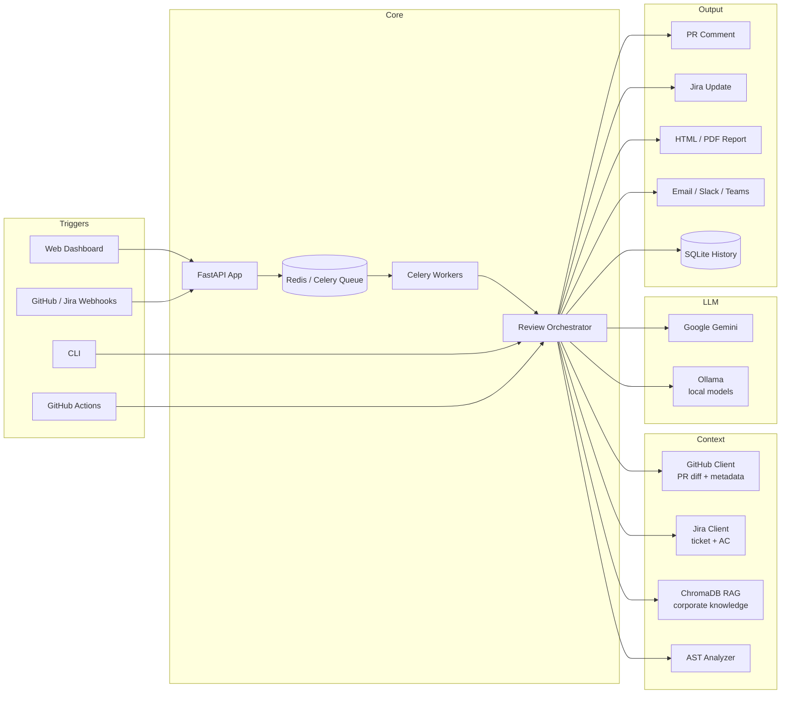

# 🦉 PRowl

> **An owl on the prowl for bugs in your PRs.**

[](https://www.python.org/)
[](https://fastapi.tiangolo.com/)
[](https://docs.celeryq.dev/)
[](https://github.com/astral-sh/ruff)
[](LICENSE)
[](https://github.com/mustafa-akgul/prowl/actions/workflows/ci.yml)

**PRowl** is an AI-powered code review agent that reviews GitHub pull requests using
**Google Gemini** or **local Ollama models**, enriched with **Jira ticket
context** and **RAG-based corporate knowledge**. Reviews can be triggered from
a web dashboard, the CLI, GitHub Actions, PR comments (`@review-agent`), or
GitHub/Jira webhooks — and results flow back as PR comments, Jira updates,
PDF/HTML reports, and Slack/Teams/email notifications.

## ✨ Features

- **Multi-LLM support** — Google Gemini (API) or any local model served by
  Ollama (e.g. `qwen2.5:7b`), with automatic fallback-model retry on quota errors
- **Multi-agent review mode** — security, performance, and style sub-agents run
  in parallel via Celery; a lead agent consolidates their findings into one
  cohesive review
- **Web dashboard** — review runner with live job status, review history,
  post-review AI chat, prompt template editor, settings panel, and a PR Kanban board
- **Jira integration** — reads ticket context and acceptance criteria into the
  prompt, writes results back, and transitions ticket status
- **RAG knowledge layer** — ChromaDB vector store injects team/company
  conventions into review prompts
- **AST analysis** — structural context (classes, functions, imports) of
  changed Python files is extracted and fed to the LLM
- **Webhooks** — GitHub and Jira webhook endpoints with HMAC signature
  verification, processed asynchronously by Celery workers
- **Reports & notifications** — HTML/PDF review reports (WeasyPrint) delivered
  via SMTP email, Slack, or Microsoft Teams
- **Three trigger paths** — dashboard UI, CLI, GitHub Actions (automatic on PR
  events, or on-demand with `@review-agent mode: security ...` comments)

## 🏗️ Architecture



More detail: [docs/ARCHITECTURE.md](docs/ARCHITECTURE.md) · REST endpoints: [docs/API.md](docs/API.md) · Plans: [docs/ROADMAP.md](docs/ROADMAP.md)

## 🚀 Quickstart

### Local

```bash
git clone https://github.com/mustafa-akgul/prowl.git && cd prowl
pip install -r requirements.txt

cp .env.example .env          # fill in your API keys
python main.py                # dashboard at http://localhost:8080
```

### Docker Compose

Runs the full stack: dashboard, Celery worker, Redis, and nginx.

```bash
cp .env.example .env
docker-compose up -d
```

## 🔑 Configuration

Settings can be managed from the dashboard **Settings** page (persisted to
`.data/config.json`) or via environment variables:

| Variable | Description | Required |
|----------|-------------|----------|
| `GEMINI_API_KEY` | Google Gemini API key | ✅ (unless using Ollama) |
| `GITHUB_TOKEN` | GitHub personal access token | ✅ |
| `GITHUB_REPO` | Target repository (`org/repo`) | ✅ |
| `JIRA_URL` / `JIRA_EMAIL` / `JIRA_API_TOKEN` | Jira Cloud connection | ❌ |
| `JIRA_REVIEW_STATUS` | Status to transition tickets to (default `In Review`) | ❌ |
| `JIRA_AC_FIELD` | Custom field ID for acceptance criteria | ❌ |
| `REDIS_URL` | Celery broker (default `redis://localhost:6379/0`) | ❌ |
| `GITHUB_WEBHOOK_SECRET` | HMAC secret for webhook verification | ❌ |
| `SMTP_*`, `SLACK_WEBHOOK_URL`, `TEAMS_WEBHOOK_URL` | Notification channels | ❌ |

See [.env.example](.env.example) for the full annotated list.

## 🖥️ Usage

### CLI

```bash
python -m agent.review_agent --pr 42 --mode base
python -m agent.review_agent --pr 42 --mode security
python -m agent.review_agent --pr 42 --mode performance --instructions "Focus on database queries"
```

### PR comment command

Comment on any pull request:

```
@review-agent mode: security focus on the authentication flow
```

### GitHub Actions

`ai-review.yml` reviews every PR automatically on open/synchronize;
`pm-command.yml` handles `@review-agent` comments. Both only need repository
secrets (`GEMINI_API_KEY`, optional Jira credentials).

## 📁 Project Structure

```
prowl/
├── main.py                  # Dashboard entry point (uvicorn launcher)
├── agent/
│   ├── review_agent.py      # Review orchestrator (CLI + pipeline)
│   ├── dashboard.py         # FastAPI web app
│   ├── github_client.py     # PR diff, comments, metadata
│   ├── jira_client.py       # Ticket context, status transitions
│   ├── base_client.py       # Abstract LLM client (templates, chunking, retry)
│   ├── gemini_client.py     # Google Gemini implementation
│   ├── ollama_client.py     # Local Ollama implementation
│   ├── celery_app.py        # Task queue configuration
│   ├── worker.py            # Celery tasks (incl. multi-agent orchestration)
│   ├── webhook_handler.py   # GitHub/Jira webhooks + HMAC verification
│   ├── ast_analyzer.py      # Structural analysis of changed code
│   ├── report_generator.py  # HTML/PDF reports
│   ├── notifier.py          # Email / Slack / Teams notifications
│   ├── db.py                # Async SQLAlchemy models (review history)
│   ├── config_manager.py    # Settings + prompt template persistence
│   ├── history_manager.py   # Review history store
│   ├── rag/                 # ChromaDB vector store + embeddings + retriever
│   ├── prompts/             # Review mode prompt templates
│   ├── static/  templates/  # Dashboard UI
├── tests/                   # pytest suite (mock-based, no network)
├── docs/                    # Architecture, API reference, roadmap
├── .github/workflows/       # CI + review triggers
└── docker-compose.yml       # Dashboard + worker + Redis + nginx
```

## 🧪 Development

```bash
pip install -e ".[dev]"      # dev tools: pytest, ruff, pre-commit

pytest tests/ -v             # run the test suite
ruff check agent/ tests/     # lint
ruff format agent/ tests/    # format
pre-commit install           # run checks on every commit
```

## 📚 Documentation

| Document | Description |
|----------|-------------|
| [docs/ARCHITECTURE.md](docs/ARCHITECTURE.md) | Component design, data flow, persistence model |
| [docs/API.md](docs/API.md) | Dashboard REST API reference |
| [docs/ROADMAP.md](docs/ROADMAP.md) | Completed milestones and planned phases |
| [CHANGELOG.md](CHANGELOG.md) | Release history |
| [CONTRIBUTING.md](CONTRIBUTING.md) | Development workflow and conventions |
| [SECURITY.md](SECURITY.md) | Vulnerability reporting policy |

## 📄 License

[MIT](LICENSE) © Mustafa Talha Akgül
