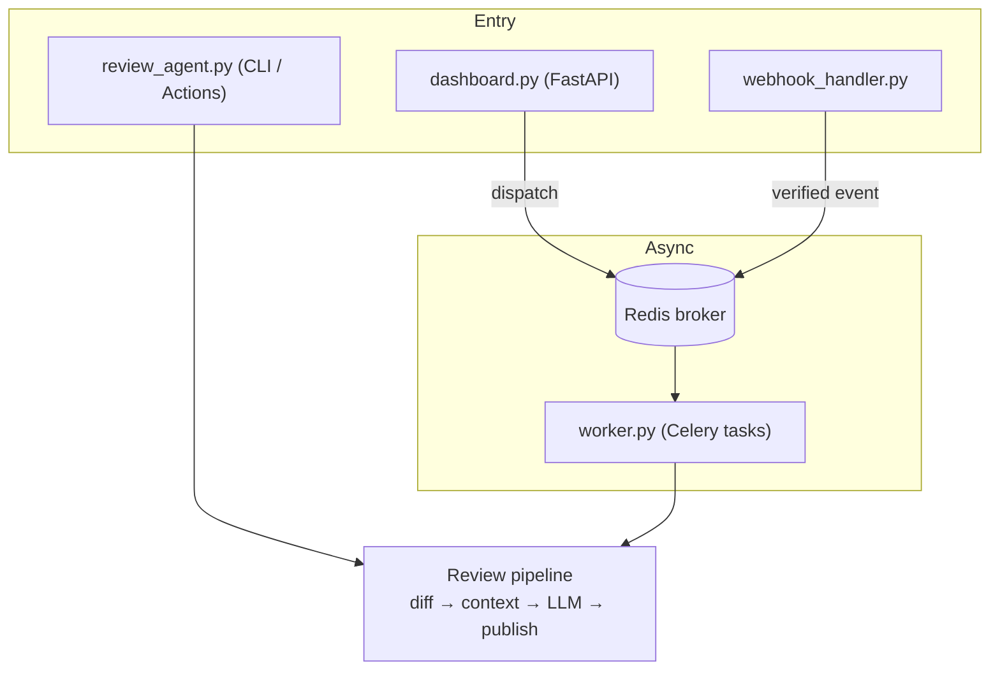
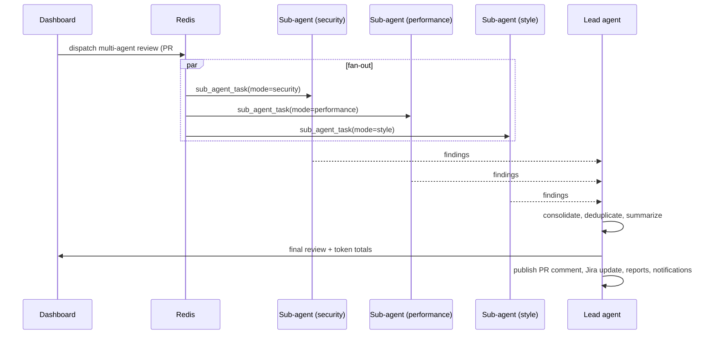
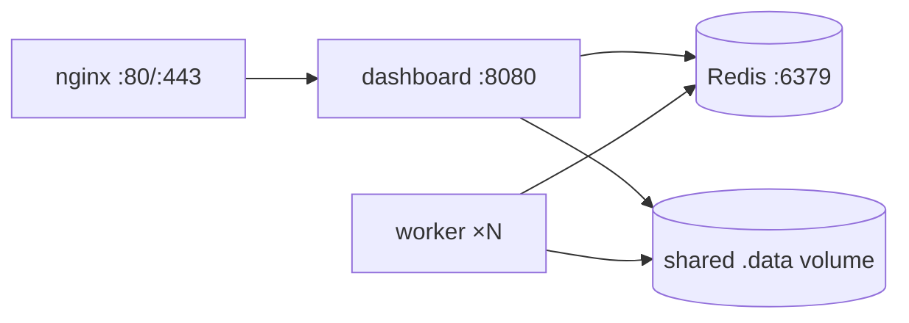

# Architecture

## Overview

The system is a review pipeline with two execution paths: a **synchronous
path** (CLI / GitHub Actions run the orchestrator in-process) and an
**asynchronous path** (dashboard and webhooks dispatch Celery tasks through
Redis to worker processes).

## Components

| Module | Responsibility |
|--------|----------------|
| `agent/review_agent.py` | Orchestrates a review: fetch diff, resolve Jira key, gather context (Jira + RAG + AST), call the LLM, publish results |
| `agent/dashboard.py` | FastAPI app: pages, review jobs, settings, prompts, board, stats endpoints |
| `agent/base_client.py` | Abstract `BaseLLMClient`: template loading, prompt preparation, diff chunking (20k chars), retry-delay parsing |
| `agent/gemini_client.py` | Gemini implementation with rate-limit retry and fallback model |
| `agent/ollama_client.py` | Local Ollama implementation (any installed model) |
| `agent/github_client.py` | PR diff/metadata/comments; Jira key extraction from PR title/body |
| `agent/jira_client.py` | Ticket read (incl. acceptance-criteria custom field), comment write, status transition |
| `agent/celery_app.py` | Celery configuration — Redis broker in production, SQLite transport for local Windows development |
| `agent/worker.py` | Celery tasks: `run_review_task`, `process_webhook_event`, and the multi-agent `sub_agent_task` / `lead_agent_task` pair |
| `agent/webhook_handler.py` | `/api/webhooks/github` + `/api/webhooks/jira` with HMAC-SHA256 verification |
| `agent/rag/` | ChromaDB vector store, pluggable embedding providers, context retriever |
| `agent/ast_analyzer.py` | Extracts classes/functions/imports around changed code via Python `ast` |
| `agent/report_generator.py` | Jinja2 → HTML → PDF (WeasyPrint) review reports |
| `agent/notifier.py` | SMTP email, Slack, and Microsoft Teams notifications |
| `agent/db.py` + `agent/history_manager.py` | Async SQLAlchemy (`aiosqlite`) review history in `.data/review_agent.db` |
| `agent/config_manager.py` | `.data/config.json` settings + `MODE_TO_FILE` prompt registry |

## Multi-agent review flow

The fan-out is a Celery **chord**: sub-agents run concurrently, and the lead
agent receives all results as its input.

## LLM client hierarchy

`BaseLLMClient` (abstract) owns everything provider-independent: loading the
prompt template for the selected mode, filling `{diff}` / `{jira_context}` /
`{pm_instructions}` placeholders, splitting oversized diffs into chunks, and
parsing rate-limit retry delays. `GeminiClient` and `OllamaClient` implement
`review()` for their providers. The active provider is chosen in Settings
(`provider` key), with an optional Gemini fallback model on quota errors.

## Configuration & persistence

- **Settings**: `.data/config.json`, written by the Settings page.
  `_apply_config_to_env()` syncs values into environment variables on save so
  client modules (which read `os.getenv`) pick up changes without restart.
  `.env` seeds the initial values.
- **Review history**: SQLite via async SQLAlchemy (`.data/review_agent.db`).
- **Vector store**: ChromaDB persisted under `.data/`.
- **Job status**: in-memory dict in the dashboard process — lost on restart by
  design (jobs are short-lived).

## Deployment topology (Docker Compose)

nginx adds security headers and long-poll timeouts; dashboard and worker share
the `.data` volume so history and config are consistent.

## Known constraints

- **Jira Cloud only** — the client hardcodes `cloud=True`
- **Windows development** — Celery falls back to a SQLite broker because Redis
  is typically unavailable locally; production always uses Redis
- Job status is in-memory; a restart loses in-flight job bookkeeping (the
  underlying Celery tasks still complete)
